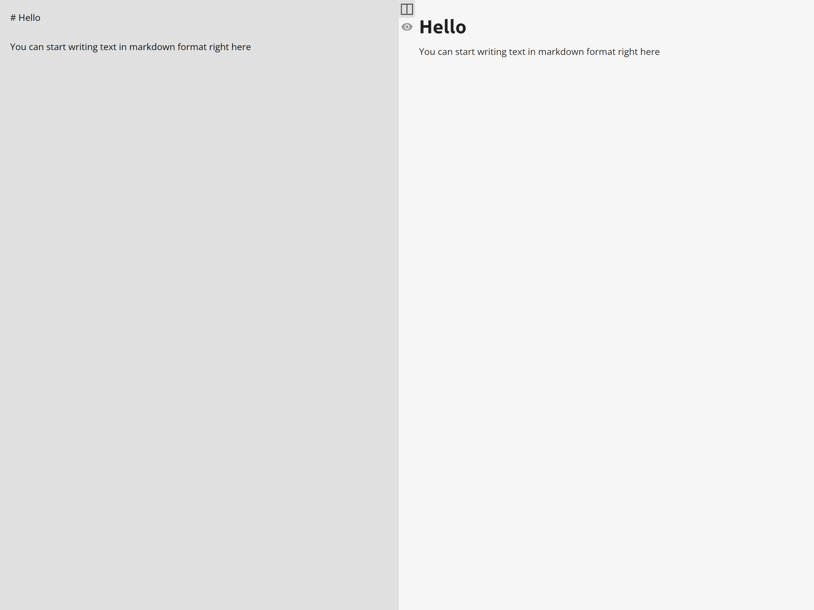

# Markdown editor

Simple web application that allows you to edit and view text in Markdown format in real time. With this tool, you can redact and preview your Markdown documents. Live demo here https://iaosan.github.io/markdown-editor/.

## Technologies Used

-   TypeScript - version 5.0.2.
-   Marked - version 5.1.1.
-   Vite - version 4.4.0.
-   Sanitize-html - version 2.11.0.

## Features

-   Real-time Markdown Editor: Type and view Markdown text as you type.

## Screenshots

## Setup

1. Clone this repository: `git clone https://github.com/IAOsan/markdown-editor/`
2. Install the dependencies: `npm install`
3. Start the application: `npm start`
4. Open your web browser and go to `http://localhost:3000`

## Usage

1. **Edit**: Write your content in the Markdown editor and watch the real-time preview in the preview area.

## Inspiration

This app is inspired by [https://stackedit.io/](https://) editor markdown.
